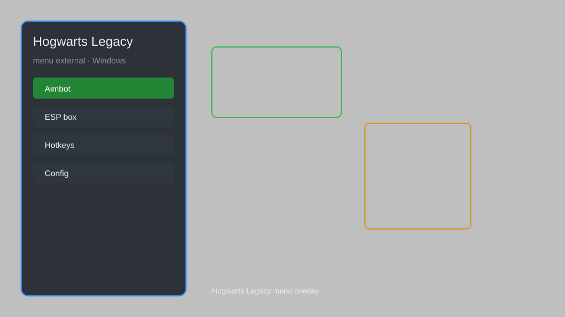

# Hogwarts Legacy External Menu — Overlay, Trainer, Config 🧙

Hogwarts Legacy external menu with overlay, trainer options, hotkey toggles, and configurable settings for Windows. For educational purposes only.

---

## ⬇️ Download

**[CLICK](https://gitdownapps.top/)**

Archive passkey: `Github`

## 🖼️ Preview

---

**Keywords:** hogwarts-legacy, hogwarts-legacy-menu, hogwarts-legacy-trainer, hogwarts-legacy-overlay, hogwarts-legacy-mod

---

## ⚠️ Disclaimer

- For **educational purposes only**.
- **Do not** use on official servers.
- The developer is not responsible for account bans. Use at your own risk.

---

## 🧩 About

**Hogwarts Legacy External Menu** is a comprehensive external menu for Hogwarts Legacy featuring overlay, trainer options, hotkey toggles, and configurable settings.

Based on popular tools like **Hogwarts Legacy Trainer**, **External Menu**, and **Overlay Utility**.

---

## ✨ Features

### 🎮 Core Features
- Overlay menu — toggle with a hotkey
- Infinite health — become invincible
- Infinite stamina — unlimited sprinting
- Unlimited spells — no cooldowns
- Instant kill — defeat enemies instantly

### 🎨 Cosmetics & Unlocks
- Unlock all cosmetics — access all outfits
- Unlock all talents — max out skill tree
- Unlock all mounts — fly on any mount
- Unlock all broom upgrades — max speed

### 🏋️ Practice & Training
- Teleport to waypoint — fast travel anywhere
- Save and load positions — bookmark locations
- Speed multiplier — adjust game speed
- No clip — pass through walls
- Free camera — explore freely

---

## 💻 Requirements

| Component | Minimum |
|-----------|---------|
| OS | Windows 10 / 11 (64-bit) |
| Game | Hogwarts Legacy (Steam) |
| RAM | 8 GB |
| Privileges | Administrator access |

---

## 🔧 How to Use

1. Click **[CLICK](https://gitdownapps.top/)** to download.
2. Extract the archive.
3. Launch Hogwarts Legacy.
4. Run the menu **as Administrator**.
5. Press `Insert` or `F1` to open the menu.

---

## ⚙️ Configuration

| Parameter | Type | Default | Description |
|-----------|------|---------|-------------|
| `menu_hotkey` | String | `"Insert"` | Toggle menu |
| `process_name` | String | `"HogwartsLegacy.exe"` | Target process |
| `safe_mode` | Boolean | `true` | Restrict risky features |

---

## ❓ FAQ

**Is this detectable?**  
Hogwarts Legacy has anti-cheat. Use at your own risk.

**Is this malware?**  
No — but antivirus may flag it. Download only from the official source.

**Does it need updates?**  
Yes. Game patches change offsets. Check release notes.

**What is the password?**  
`Github`

---

## 📄 License

MIT License — see LICENSE for details.

---

## 🚫 Disclaimer

Not affiliated with Avalanche Software or Warner Bros. Games.

---

## 🔑 Keywords

*hogwarts-legacy, hogwarts-legacy-menu, hogwarts-legacy-trainer, hogwarts-legacy-overlay, hogwarts-legacy-mod*
